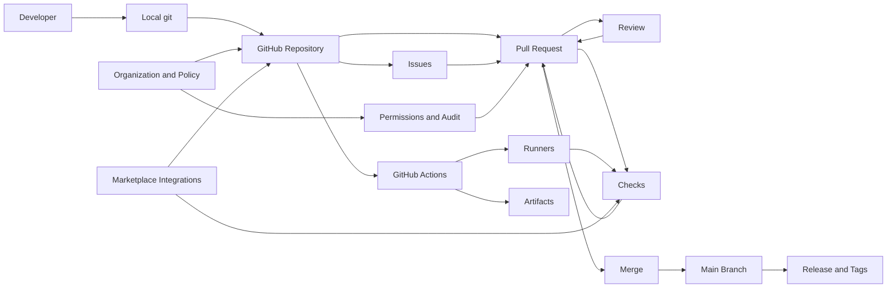

# GitHub — Product Teardown (v2)

## 0) TL;DR
GitHub is the default **system of record for software change**: it stores code, turns changes into reviewable proposals (PRs), gates them with policy + automation (checks), and then broadcasts outcomes (merge/release) to humans and tools.

The product’s durable advantage is not “git hosting” — it’s the **workflow standard** (PR + branches + checks), the **identity/permission graph**, and the **ecosystem** (Actions, Marketplace, integrations) that compounds switching costs.

---

## 1) Positioning

**What it is:** A developer collaboration platform that hosts git repositories, enables review and governance, coordinates work, and automates software delivery.

**Core promise:** Make building software **collaborative, auditable, and shippable** — from idea → code → review → release.

### Target users
- **Primary:** Software teams (startups → enterprise) shipping production code.
- **Secondary:** Open-source maintainers & contributors; DevOps/SRE; security/compliance teams; students/learners.

### Jobs-to-be-done
- “Help me ship changes safely, with the right people involved, and a durable record of what happened.”
- “Help me run engineering governance without slowing developers to a crawl.”
- “Help my project attract contributors and keep the community healthy.”

### When GitHub is the obvious choice
- You want a **standard workflow** (branching + PR review) that everyone already understands.
- You need **visibility & accountability** (history, audit trails, code ownership).
- You want **automation and integrations** close to the code (CI, checks, bots, deployments).

---

## 2) Product model (objects + primitives)

### Core objects
- **User / Organization / Enterprise:** Identity + policy boundary + billing.
- **Repository:** Container for code, configuration, issues, actions, security, packages.
- **Branch / Commit:** Immutable history and lines of development.
- **Pull Request:** Proposal to merge changes + discussion + review + checks.
- **Review / Comment / Suggestion:** Human approval + feedback.
- **Check / Status:** CI signals attached to commits/PRs.
- **Issue / Discussion:** Problem statement + async coordination.
- **Label / Milestone / Assignee:** Triage primitives.
- **Project:** Planning surface (boards/roadmaps) aggregating issues/PRs.
- **Release / Tag:** Versioned milestone.
- **Workflow (Actions):** Automation graph triggered by repo events.
- **Package / Artifact:** Build outputs (Packages, Releases, Actions artifacts).

### High-leverage primitives
- **Protected branches:** Required reviews/checks; restrict pushes.
- **CODEOWNERS:** Review routing / ownership enforcement.
- **Required status checks:** Makes CI a gate, not just “info.”
- **Search:** Code + issues/PRs + users + repos (filters are power-user leverage).
- **Notifications:** Attention routing across mentions, review requests, subscriptions.
- **Permissions:** Repo/org roles; SSO/SAML; fine-grained tokens (enterprise).

---

## 3) Core loops

### Loop A — Team shipping loop (Branch → PR → Review → Merge → Deploy)
**Goal:** Ship changes quickly without breaking production.

1. Developer creates branch and commits changes.
2. Opens PR with context, linked issues, screenshots, rollout notes.
3. Review is requested (directly or via CODEOWNERS).
4. CI runs (tests, lint, build, security scans) and reports as Checks.
5. Review feedback cycles; author updates.
6. Merge via policy (merge/squash/rebase).
7. Actions optionally deploys, cuts releases, updates changelogs.

**Why it reinforces:** Reliable checks + predictable review = higher throughput and more trust in “main is safe.”

### Loop B — Coordination loop (Issue → Triage → Plan → PR)
**Goal:** Turn ambiguous problems into trackable work linked to code.

- Issues become a shared queue.
- Projects provide status + roadmap surfaces.
- PRs link back to issues, creating traceability from “why” → “what changed.”

### Loop C — Open-source contribution loop (Discover → Fork → PR → Merge → Reputation)
**Goal:** Enable contribution across org boundaries.

- Discovery via search/stars/dependencies.
- Contribution via forks + PRs.
- Reputation via profiles, graphs, and visible work history.

### Loop D — Automation loop (Event → Workflow → Signal → Human action)
**Goal:** Turn repo events into automated verification and operational outcomes.

- PR opened → CI runs → check results gate merge.
- Merge → build → deploy → release notes.

### Loop E — Security & compliance loop (Policy → Detection → Remediation → Audit)
**Goal:** Keep software safe while creating provable evidence.

- Branch rules + code review + mandatory checks.
- Secret scanning, dependency alerts, code scanning.
- Audit logs + evidence for compliance.

---

## 4) Key surfaces (how the product is experienced)

### 4.1 Repository home
- README, file tree, default branch view.
- Trust builders: stars/forks, releases, security indicators, activity.

### 4.2 Pull Requests (the “decision surface”)
- Diff + conversation + checks + approvals.
- Merge controls + policy visibility.
- This is the product’s center of gravity.

### 4.3 Code review UX
- Inline comments, suggestions, viewed state, batch review.
- Tension: **high-quality review** vs **review fatigue**.

### 4.4 Issues + Discussions
- Templates/forms, labels, milestones.
- Maintainer ergonomics is the bottleneck at scale (triage + spam).

### 4.5 Projects
- Planning surface across repos.
- Hard problem: flexible enough for every team without becoming a blank spreadsheet.

### 4.6 Search & discovery
- Code search and global search drive both productivity and network effects.

### 4.7 Notifications
- The attention router. If it’s noisy, users route everything to Slack or ignore it.

### 4.8 Actions
- YAML authoring, runners, logs, artifacts.
- Strong lock-in: CI/CD definitions live next to code, with deep integration into PR gating.

### 4.9 Marketplace & integrations
- Apps, checks, bots, security tools.
- The ecosystem is a moat; the ecosystem also creates complexity and support burden.

---

## 5) Business model (how GitHub makes money)

### Primary revenue streams
- **Seat-based subscriptions**: Team/Enterprise plans (governance, security, compliance).
- **Consumption**: Actions minutes, storage, hosted runners.
- **Add-ons**: Advanced Security, governance features, enterprise support.

### The pricing “truth”
GitHub monetizes where it creates enterprise-grade certainty:
- policy enforcement
- auditability
- security tooling
- operational scale (runners, reliability)

---

## 6) Moats & switching costs

### Moats
- **Workflow standardization**: PRs, checks, and branch protection are universal language.
- **Identity + permission graph**: org membership, teams, repo permissions, SSO.
- **Network effects**: OSS discovery, reputations, contributors, dependency graphs.
- **Ecosystem**: Marketplace + integrations; “everything connects to GitHub.”

### Switching costs (what actually traps you)
- Actions workflows and CI/CD plumbing.
- Governance rules, audit posture, security baselines.
- Cross-linking of issues/PRs/releases across years.
- Team habits and muscle memory.

---

## 7) Competitive landscape (why GitHub keeps winning)

- **GitLab**: stronger single-application DevOps story; wins when buyers want “one tool” with deep CI/CD.
- **Bitbucket**: fits Atlassian ecosystems.
- **Self-hosted git**: chosen for control/compliance, but often loses on UX + ecosystem.

Opinion: GitHub wins because it’s the **default social + operational layer** for software, not because it’s the best at any single sub-feature.

---

## 8) Metrics & instrumentation plan

### North Star (team/org)
**Weekly Active Repos with Successful Merges (WAR-SM)**
- Repo counts in a week if:
  - ≥ N distinct contributors (authors or reviewers)
  - and ≥ M PRs merged
  - and ≥ X% of merged PRs passed required checks

### Leading indicators
- **PR cycle time**: open → first review; open → merge (p50/p90).
- **Review health**: % PRs reviewed within T hours; approvals per PR; comment depth.
- **CI reliability**: pass rate, flaky rate, median CI duration.
- **Policy compliance**: protected-branch merges; bypass attempts.
- **Traceability**: % PRs linked to issues; auto-close on merge rate.
- **Notification overload**: mute/unwatch rate; ignored review requests.

### OSS health (maintainer lens)
- time-to-first-response
- contributor conversion: first-time → repeat
- backlog pressure: open growth vs close rate
- spam/abuse rate and moderation time

---

## 9) Key trade-offs & constraints

### 9.1 Flexibility vs standardization
GitHub has to serve solo projects, enterprises, and chaotic open source.

Opinion: GitHub should keep the **core loop (PR + checks + policy)** extremely strong and make everything else extensible.

### 9.2 Security vs developer speed
Too many gates slow teams and encourage bypass behavior; too few gates increase incidents.

### 9.3 Ecosystem power vs platform complexity
Every integration increases value and surface area (support, permissions, security).

### 9.4 Moderation at scale
OSS is vulnerable to spam, low-quality issues, and supply-chain threats.

---

## 10) What I would prioritize (PM 30–60–90)

### First 30 days
- Segment: enterprise vs SMB vs OSS maintainers.
- Baseline:
  - PR cycle time distribution
  - CI duration + flakiness
  - notification overload signals
  - maintainer backlog + spam rate
- Pick top 2 friction clusters (review latency, CI noise, issue spam).

### 60 days
- **Review routing**: load-aware reviewer suggestions (CODEOWNERS + activity + team load).
- **PR quality nudges**: require “why / risk / rollout” fields; highlight risky diffs.
- **CI signal clarity**: dedupe flaky failures; clearer failing-step attribution.

### 90 days
- **Review inbox**: priority ranking, SLA views, and batching to reduce fatigue.
- **Maintainer tooling**: spam-resistant issue intake (forms, rate limits, reputation).
- **Org insights**: dashboards connecting throughput (cycle time) to quality proxies.

---

## Appendix — GitHub system map (conceptual)

