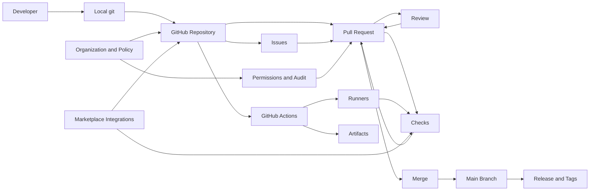

# GitHub — Product Teardown (v3)

> Lens: Product Manager • Scope: publicly observable behavior + general software industry patterns (no internal GitHub metrics claims)

---

## Product in one sentence
GitHub is the **system of record for software change**: it hosts code and package artifacts, turns changes into reviewable proposals (PRs), enforces governance with policy + automation (checks), and broadcasts outcomes (merge/release/security) to humans and tools.

---

## 0) TL;DR
- GitHub’s durable edge is not “git hosting” — it’s the **workflow standard** (branch → PR → checks → merge), the **identity & permission graph** (orgs/teams/CODEOWNERS/audit), and the **ecosystem** (Actions, Marketplace, integrations) that compounds over time.
- The center of gravity is the **Pull Request as the decision surface**: discussion + review + CI signals + policy gating in one place.
- The product’s hardest ongoing problem is **attention routing**: getting the *right* humans to look at the *right* changes and making the automation signal trustworthy.

---

## 1) Who it serves
### Primary users
- **Software teams** (startups → enterprise) shipping production code.
- **Open-source maintainers and contributors** coordinating across org boundaries.

### Secondary users
- **Security / compliance** teams (policy, evidence, audit, vulnerability workflows).
- **DevOps / SRE** (CI/CD, release workflows, reliability of automation).
- **Students / learners** (portfolio + contribution graph).

### Jobs-to-be-done
- “Help me ship changes safely, with the right people involved, and a durable record of what happened.”
- “Help me enforce engineering governance without slowing developers to a crawl.”
- “Help my project attract contributors and keep the community healthy.”

---

## 2) Value props → measurable outcomes
For a team:
- **Throughput with safety** → PR cycle time (open→first review, open→merge), regression rate, change failure rate.
- **Governance** → % merges that complied with branch rules, bypass attempts, audit completeness.
- **Automation close to code** → CI setup time, flaky rate, mean time to diagnose failures.

For OSS maintainers:
- **Contribution friendliness** → time-to-first-response, contributor conversion (first-time → repeat), moderation time.
- **Trust signals** → security posture indicators, dependency insights, release hygiene.

---

## 3) Product model (objects + primitives)
### Core objects
- **User / Organization / Enterprise**: identity boundary, policy, billing.
- **Repository**: container for code + configuration + history + collaboration surfaces.
- **Branch / Commit**: immutable history and lines of development.
- **Pull Request**: change proposal + discussion + review + checks + merge decision.
- **Review / Comment / Suggestion**: human approval + feedback.
- **Check / Status**: automation signals attached to commits/PRs.
- **Issue / Discussion**: problem statement + async coordination.
- **Label / Milestone / Assignee**: triage primitives.
- **Project**: planning layer aggregating issues/PRs.
- **Release / Tag**: versioned milestone.
- **Workflow (Actions)**: automation graph triggered by repo events.
- **Package / Artifact**: build outputs (Packages, Releases, Actions artifacts).

### High-leverage primitives (the “governance toolkit”)
- **Protected branches**: require reviews/checks; restrict pushes.
- **CODEOWNERS**: review routing and ownership enforcement.
- **Required status checks**: turns CI into a gate, not just “FYI.”
- **Search** (code + issues/PRs): power-user productivity and discovery.
- **Notifications**: attention router across mentions, review requests, subscriptions.
- **Permissions**: org roles, teams, fine-grained tokens, SSO/SAML, audit logs.

---

## 4) Core loops (why usage compounds)
### Loop A — Team shipping loop (Branch → PR → Review → Merge → Deploy)
1. Create branch and commits.
2. Open PR with context (why, risk, rollout).
3. Review requested (directly or via CODEOWNERS).
4. CI runs (tests/lint/build/security scans) and reports checks.
5. Iterate on feedback.
6. Merge via policy (merge/squash/rebase).
7. Actions optionally deploys, cuts release, updates changelog.

Reinforcement: when checks are reliable and routing is good, teams trust “main is safe,” which increases velocity and standardizes more work onto GitHub.

### Loop B — Coordination loop (Issue → Triage → Plan → PR)
- Issues become a shared queue.
- Projects provide planning surfaces.
- PRs link back to issues, creating traceability from “why” → “what changed.”

### Loop C — OSS contribution loop (Discover → Fork → PR → Merge → Reputation)
- Discovery via search/stars/dependencies.
- Contribution via forks + PRs.
- Reputation via public work history and graphs.

### Loop D — Automation loop (Event → Workflow → Signal → Human action)
- PR opened → workflow runs → check results gate merge.
- Merge → build → deploy → release notes.

---

## 5) Key surfaces (where the experience is won or lost)
### 5.1 Pull Requests: the decision surface
- Diff + conversation + checks + approvals.
- Merge controls + policy visibility.
- “PR quality” (context, screenshots, rollout notes) is a major determinant of review time.

### 5.2 Code review UX
- Inline comments, suggestions, batch review, viewed state.
- Core tension: **high-quality review** vs **review fatigue**.

### 5.3 Issues + Discussions
- Templates/forms, labels, milestones.
- At scale, maintainer ergonomics (triage + spam + moderation) becomes the bottleneck.

### 5.4 Notifications
- The attention router; if it’s noisy, users route it to Slack or ignore it.

### 5.5 Actions
- YAML authoring, runners, logs, artifacts.
- Lock-in: CI/CD definitions live next to code and integrate deeply into PR gating.

### 5.6 Search & discovery
- Code search and global search drive productivity and network effects.

---

## 6) Business model (how GitHub makes money)
- **Seat-based subscriptions** (Team/Enterprise): governance, compliance, security posture.
- **Consumption**: Actions minutes, storage, hosted runners.
- **Add-ons**: Advanced Security, enterprise support.

Pricing truth: GitHub monetizes where it creates **enterprise-grade certainty** (policy enforcement, auditability, security, operational scale).

---

## 7) Moats & switching costs
### Moats
- **Workflow standardization**: PRs/checks/branch protection are the industry’s shared language.
- **Identity + permissions graph**: org membership, teams, repo permissions, SSO.
- **Network effects**: OSS discovery, reputation, dependency graph.
- **Ecosystem**: marketplace apps, bots, security tools, CI providers.

### Switching costs
- Actions workflows and CI/CD plumbing.
- Governance rules + audit posture + security baselines.
- Cross-linking of issues/PRs/releases across years.
- Team muscle memory and external integrations.

---

## 8) Competitive landscape (why GitHub keeps winning)
- **GitLab**: strongest “single application” DevOps story; wins when buyers want one tool with deep CI/CD.
- **Bitbucket**: fits Atlassian ecosystems.
- **Self-hosted git**: chosen for control/compliance; often loses on UX + ecosystem + default-status.

Opinion: GitHub wins because it’s the **default social + operational layer** for software, not because it’s best at every sub-feature.

---

## 9) Metrics & instrumentation plan (what I’d track)
### North Star
**Weekly Active Repos with Successful Merges (WAR-SM)**
- A repo counts in a week if:
  - ≥ N distinct contributors (authors or reviewers)
  - ≥ M PRs merged
  - ≥ X% of merged PRs passed required checks

### Leading indicators
- **PR cycle time**: open→first review; open→merge (p50/p90).
- **Review health**: % PRs reviewed within T hours; approvals per PR; comment depth.
- **CI reliability**: pass rate, flaky rate, median CI duration.
- **Policy compliance**: protected-branch merges; bypass attempts.
- **Traceability**: % PRs linked to issues; auto-close-on-merge rate.
- **Notification overload**: mute/unwatch rate; ignored review requests.

### OSS health (maintainer lens)
- time-to-first-response
- contributor conversion: first-time → repeat
- backlog pressure: open growth vs close rate
- spam/abuse rate and moderation time

---

## 10) Key trade-offs & constraints
- **Flexibility vs standardization**: serve solo projects, enterprises, and chaotic OSS.
- **Security vs developer speed**: too many gates cause bypass; too few cause incidents.
- **Ecosystem power vs platform complexity**: every integration increases value and risk.
- **Moderation at scale**: spam and low-quality issues are a constant tax.

---

## 11) What I would prioritize (PM 30–60–90)
### First 30 days
- Segment: enterprise vs SMB vs OSS maintainers.
- Baseline:
  - PR cycle time distribution
  - CI duration + flakiness
  - notification overload signals
  - maintainer backlog + spam rate
- Pick top 2 friction clusters (commonly: review latency, CI noise, issue spam).

### Next 60 days
- **Review routing**: load-aware reviewer suggestions (CODEOWNERS + recent activity + team load) and clearer “why you were requested.”
- **PR quality nudges**: lightweight required fields (why / risk / rollout) and better templates.
- **CI signal clarity**: dedupe flaky failures, highlight root-cause step, and summarize failures in PR.

### Next 90 days
- **Review inbox**: priority ranking, batching, SLA views, and “unblock me” shortcuts.
- **Maintainer tooling**: spam-resistant issue intake (forms + rate limits + reputation signals).
- **Org insights**: dashboards connecting throughput (cycle time) to quality proxies (incidents, reverts, flaky checks).

---

## Appendix — GitHub system map (conceptual)

