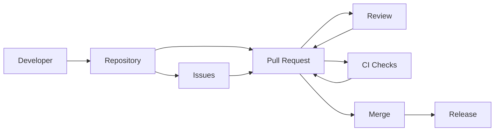

# GitHub - Product Teardown (v1)

## 1) Positioning

**What it is:** GitHub is a developer collaboration platform that hosts code (Git repos), enables change review (Pull Requests), coordinates work (Issues/Projects), and automates delivery (Actions), wrapped in identity, permissions, and community discovery.

**Core promise:** Make building software **collaborative, auditable, and shippable**—from idea → code → review → release.

### Target users
- **Primary:** Software teams (startups → enterprise) collaborating on codebases.
- **Secondary:** Open-source maintainers & contributors; students/learners; DevOps/SRE; security teams.
- **Job-to-be-done:** “Help me ship changes safely with the right people involved and a durable record of what happened.”

### When GitHub is the obvious choice
- You need a **standard collaboration workflow** (branching + PR review) with a strong ecosystem.
- You want **visibility & accountability** (history, code ownership, audit trails).
- You need **integrations and automation** close to code (CI, checks, bots).

---

## 2) Product model (objects + primitives)

### Core objects
- **Account / Organization:** Identity + billing + policy boundary.
- **Repository:** The container for code, configuration, issues, wiki, actions.
- **Branch:** A line of development; often maps to “work in progress” vs “main”.
- **Commit:** Atomic change unit; immutable history node.
- **Pull Request (PR):** Proposal to merge changes + discussion + review + checks.
- **Review / Comment:** Feedback and approval gates.
- **Check / Status:** CI signals attached to commits/PRs.
- **Issue:** Work item / bug / task; discussion anchored to a problem statement.
- **Label / Milestone / Assignee:** Triage primitives.
- **Project:** Planning surface (boards, roadmaps) that aggregates issues/PRs.
- **Release / Tag:** Versioned milestone for distribution.
- **Workflow (Actions):** Automation graph triggered by repo events.

### Key primitives
- **Fork + clone:** Contribution model for open source; copy vs local working.
- **Protected branches:** Policy primitives (required reviews, required checks, no force-push).
- **CODEOWNERS:** Ownership routing for reviews.
- **Search:** Code, issues/PRs, users, repos; filters are power-user primitives.
- **Notifications:** Attention routing across mentions, review requests, subscriptions.
- **Permissions:** Repo roles; fine-grained controls in enterprise contexts.

---

## 3) Core loops

### Loop A — Team shipping loop (Branch → PR → Review → Merge → Deploy)
**Goal:** Let teams ship changes quickly without breaking production.

**Trigger / input**
- A developer starts work on a feature/bug.

**Actions**
1. Create a branch and commit changes.
2. Open a PR with description, context, linked issues.
3. Request review (directly or via CODEOWNERS).
4. CI runs as Checks (tests, lint, build, security scans).
5. Review feedback cycles; author updates.
6. Merge (often to main) using merge/squash/rebase policy.
7. (Optionally) Actions triggers deployment and release creation.

**Output / value**
- Changes land with higher confidence and shared understanding.
- A durable record exists: what changed, why, who approved, which checks ran.

**Reinforcement**
- The more reliable checks + review are, the more teams trust the loop and increase throughput.

---

### Loop B — Work discovery & coordination loop (Issue → Triage → Plan → PR)
**Goal:** Turn ambiguous problems into trackable work that links to code changes.

**Trigger / input**
- A bug report, feature request, or debt item appears.

**Actions**
1. Create issue; capture reproduction, expected behavior, scope.
2. Triage via labels, priority, severity, assignment.
3. Plan via Projects (status, sprint, roadmap) and milestones.
4. Link PRs to issues; close automatically on merge.

**Output / value**
- A shared queue with prioritization and clear ownership.

**Reinforcement**
- Linking issues ↔ PRs creates traceability; teams adopt GitHub as the system of record for engineering work.

---

### Loop C — Open-source contribution loop (Discover → Fork → PR → Merge → Reputation)
**Goal:** Enable contribution across organizational boundaries.

**Trigger / input**
- A developer discovers a repo via search, social proof (stars), or dependency usage.

**Actions**
1. Read README/contributing guidelines; pick an issue.
2. Fork, make changes, open PR.
3. Maintainer reviews; CI validates.
4. Merge; contributor credited.

**Output / value**
- Project improves; contributor gains reputation; maintainer leverages distributed labor.

**Reinforcement**
- Stars, followers, contribution graphs, and profile visibility create a career incentive.

---

### Loop D — Automation loop (Event → Workflow → Signal → Human action)
**Goal:** Automate repetitive engineering work and keep humans focused on decisions.

**Trigger / input**
- PR opened, push to branch, issue labeled, schedule, manual dispatch.

**Actions**
1. Actions workflow runs jobs.
2. Posts status back as Checks/comments.
3. On failure: developer iterates; on success: merge/unblock.

**Output / value**
- Reduced manual toil; fewer regressions; faster feedback.

**Reinforcement**
- Teams add more automation once the feedback loop is trusted.

---

## 4) Key surfaces & components (how the product is experienced)

### 4.1 Repository home
- README, file tree, default branch view.
- Trust builders: stars/forks, recent activity, releases, security badges.

### 4.2 Pull Requests
- The “decision surface” for code changes: diff, conversation, commits, checks, reviewers.
- Merge controls + policy visibility (required approvals, required checks).

### 4.3 Code review UX
- Inline comments, suggestions, “viewed” state, batch review.
- The real product tension: **high-quality review** vs **review fatigue**.

### 4.4 Issues
- Issue templates, forms, labels, milestones.
- Maintainer ergonomics matters: triage at scale is the bottleneck.

### 4.5 Projects
- Planning layer that aggregates across repos.
- Hard problem: flexibility vs opinionated workflows; most orgs have custom processes.

### 4.6 Search & discovery
- Code search (power users), issue/PR search, repo discovery.
- Drives open-source network effects (stars → more contributors → better projects).

### 4.7 Notifications
- Review requests, mentions, subscriptions, watching repos.
- If notifications are noisy, users either ignore GitHub or route everything to Slack.

### 4.8 Actions
- Workflow authoring (YAML), logs, artifacts.
- Strong lock-in: CI configured close to repo; switching costs grow over time.

---

## 5) Metrics & instrumentation plan

GitHub’s “unit of value” differs by segment:
- **Team/Org value:** shipping safely and predictably.
- **Open source value:** contribution throughput + maintainer sustainability.

### 5.1 North Star (team/org)
**Weekly Active Repos with Successful Merges (WAR-SM)**
- A repo counts in a week if it has:
  - ≥ N distinct contributors (authors or reviewers)
  - and ≥ M PRs merged
  - and ≥ X% of merged PRs passed required checks

**Why this works:** It avoids vanity metrics (page views, stars) and anchors on durable value: collaborative shipping with quality gates.

### 5.2 Leading indicators
- **PR cycle time:** open → first review; open → merge (p50/p90).
- **Review health:** % PRs receiving review within T hours; review depth (comments/PR), approval rate.
- **CI reliability:** check pass rate, flaky test rate, median CI duration.
- **Branch protection compliance:** % merges on protected branches; bypass events.
- **Issue-to-PR linkage:** % PRs linked to issues; issue close rate.
- **Notification overload:** mute/unwatch rate, ignored review requests, email → product re-engagement.

### 5.3 Open source health metrics (maintainer lens)
- **Time-to-first-response** on issues/PRs.
- **Contributor conversion:** first-time contributor → repeat contributor.
- **Backlog pressure:** open issues growth vs close rate.
- **Spam/abuse rate:** flagged content rate; maintainer time spent moderating.

---

## 6) Key trade-offs & constraints

### 6.1 Flexibility vs standardization
GitHub has to serve:
- 1-person projects, huge enterprises, and chaotic open-source communities.

Opinion: GitHub wins by making **the core loop (PR)** very strong and letting everything else be “good enough + extensible.”

### 6.2 Security vs developer speed
- Protected branches, required reviews, and secret scanning increase safety.
- But too many gates can slow teams and encourage bypass behaviors.

### 6.3 Ecosystem lock-in vs portability
- Actions workflows, marketplace apps, and checks create deep lock-in.
- Portability matters for trust; the product should keep exports/migrations credible.

### 6.4 Moderation at scale
- Open source attracts spam, low-quality issues, and supply-chain risks.
- GitHub’s success depends on keeping maintainer burden manageable.

---

## 7) What I would prioritize (PM 30–60–90)

### First 30 days (diagnose + pick a wedge)
- Segment users: enterprise teams vs SMB vs open source maintainers.
- Baseline:
  - PR cycle time distribution (by repo size)
  - CI duration + flakiness
  - notification overload signals
  - maintainer backlog + spam rate
- Identify top 2 “friction clusters” causing drop-offs (e.g., review latency, CI noise, issue spam).

### 60 days (ship targeted improvements)
- **Review request routing:** smarter defaults (CODEOWNERS + recent activity + load balancing).
- **PR quality nudges:** better templates, risk signals (test coverage change, large diffs), “what changed/why” prompts.
- **CI signal clarity:** highlight failing step causes, dedupe flaky failures, annotate diffs with test impact.

### 90 days (scale + harden)
- **Notification tuning:** unify settings; ship “review inbox” with priority ranking.
- **Maintainer tooling:** spam-resistant issue intake (forms, rate limits, reputation, auto-triage).
- **Insights:** org-level dashboards that connect engineering throughput to quality (cycle time vs rollback/incident proxies).

---

## Appendix — A simple GitHub system map (conceptual)

