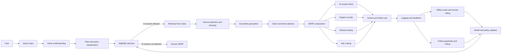

<p align="center">
  
</p>

# Teardown: Google Search - Adding AI Answers Without Breaking the Web

**Product:** Google Search (consumer search + ads + publisher ecosystem)  
**Author:** Mayank Malviya  
**Date:** 17 Mar 2026  
**Status:** v3 — added system architecture diagram, KPI scorecard, freshness/breaking-news handling, and clearer publisher value-exchange options

> Notes on sources: This teardown is based on product understanding and public industry patterns. Exact ranking/ads policies, model behavior, and UI labels below are *representative*, not official.

---

## What changed in v3 (vs v2)
- Added a **Mermaid system diagram** of the AI SERP pipeline (eligibility → retrieval → generation → citations → ads/vertical routing → logging/evals).
- Added a **practical KPI scorecard** (user success, trust/safety, publisher health, revenue) with example metric definitions.
- Expanded **freshness + breaking news** tactics: query classing, cache strategy, time-decay, source constraints, and safe fallbacks.
- Made the **publisher value exchange** more explicit with concrete UX/mechanism options (qualified clicks, claim-anchored citations, deeper attribution, licensing).

---

## TL;DR (what matters)
- “AI in Search” is not a feature; it’s a **re-architecture of the SERP contract**: from “links first” to “answers + actions first” while still funding the ecosystem via **ads** and sustaining the **open web**.
- The core tension is **helpfulness vs. attribution vs. monetization**:
  - AI answers reduce clicks (good for users) but risk **publisher value collapse** (bad for the web) and can reduce **commercial intent capture** (bad for ads) unless redesigned carefully.
- The real moat is distribution + infrastructure: **query volume**, **freshness**, **index quality**, **anti-abuse**, **latency**, and a **feedback loop** turning user interactions into relevance and trust.
- The hardest PM problem: deciding **when to answer** vs **when to cite + send traffic** vs **when to ask a clarifying question**, with guardrails for safety, policy, and correctness.

---

## 1) What Google Search is (in one line)
A **universal intent router**: it takes a query, infers intent, and returns the best next step (answer, website, product, map, call, reservation), monetized primarily through **ads aligned to intent**.

---

## 2) The user’s job-to-be-done (JTBD)
**Primary JTBD:** “Help me get the right outcome fast, with minimal effort.”

**Intent buckets (practically useful):**
- **Know**: learn/explain/summarize (e.g., “why is my phone hot”).
- **Do**: complete a task (e.g., “renew passport online”).
- **Go**: navigate locally (e.g., “coffee near me”).
- **Buy**: compare/purchase (e.g., “best noise cancelling headphones under 200”).

AI shifts the experience most for:
- **Know** queries (synthesis, explanations, structured steps)
- high-consideration **Buy** queries (comparison + shortlisting)

---

## 3) The core loop (per-query)
Search doesn’t have a traditional “onboarding funnel”. The funnel is **every query**.

**Query loop:**
1) **Query issued** (typed/voice/image)
2) **SERP viewed** (answers, ads, modules, links)
3) **Action taken** (click, refine, follow-up, call, navigate)
4) **Outcome** (task done / purchase / learning)
5) **Satisfaction signals** (reformulations, dwell, back-to-SERP)

AI adds a parallel path:
- **AI answer consumed** → follow-up prompts → cited sources → deeper exploration

A simple mental model:

```
Query
  ↓
Understand intent + risk
  ↓
Decide: Answer | Ask | Route to vertical | Links
  ↓
Show: AI block + citations + actions + organic + ads
  ↓
Measure: satisfaction + ecosystem + revenue
```

---

## 4) System architecture: AI-enhanced SERP pipeline
This is the “operating system” view of AI Search.



**Key PM levers hidden in the diagram:**
- **Eligibility** is where product policy becomes code (and where most mistakes get prevented).
- **Retrieval + source selection** determines both *truthfulness* and *publisher outcomes*.
- **SERP composition** is where you protect monetization without corrupting trust.

---

## 5) What changes when you add AI to Search

### 5.1 The SERP contract shifts
Traditional contract: *“We’ll rank the best documents.”*

AI contract: *“We’ll produce the best response (with sources) — and sometimes you won’t need to click.”*

This creates new product obligations:
- **Attribution** must be credible and visible
- **Uncertainty** must be represented (especially for contested topics)
- **Choice** must remain (multiple sources, perspectives)
- **Freshness** must be guarded (time-sensitive answers)

### 5.2 Retrieval + generation becomes a product primitive
The user experience quality depends on:
- **Retrieval**: what sources are eligible and selected
- **Grounding**: how tightly the answer is constrained to sources
- **Presentation**: citations, quotes, source diversity
- **Follow-ups**: conversation that doesn’t lose the original intent

### 5.3 New failure modes
- Confident wrong answers (hallucinations)
- Citation errors (misattribution)
- Stale info (freshness gaps)
- Over-summarization (nuance loss)
- Publisher harm (traffic cannibalization without value return)

---

## 6) Information architecture (IA): the “AI SERP”
A representative AI-enhanced SERP contains:
- **AI answer block** (summary + sections + steps)
- **Citations** (links; ideally anchored to claims)
- **Organic results** (traditional links)
- **Vertical modules** (maps, shopping, news, videos)
- **Ads** (text, shopping, local)
- **Follow-up prompts** (ask next question)

**The IA challenge:** the AI block can become a dead-end if it doesn’t:
- encourage deeper exploration when appropriate
- route commercial intent cleanly to shopping/results
- preserve user agency (sources + alternatives)

---

## 7) The policy engine: when should AI answer?
A good heuristic policy (not official):

**AI should answer when:**
- Intent is informational and can be grounded to multiple sources
- The task is multi-step but generic
- The query benefits from synthesis (comparison, pros/cons, structured plan)

**AI should ask a clarifying question when:**
- The query is underspecified and branching (e.g., “best laptop”) and clarification reduces wasted work

**AI should avoid answering or heavily constrain when:**
- High-risk domains without strong grounding (medical, legal, finance)
- Breaking news without freshness guarantees
- Navigational queries where the user wants a specific site

**PM nuance:** “avoid answering” doesn’t mean “no AI”. It can mean:
- show sources first
- provide a checklist of what to consider
- ask clarifying questions

---

## 8) Freshness + breaking news (where AI answers get dangerous)
Freshness isn’t one thing; it’s a set of policies + infrastructure decisions.

### 8.1 Query classing (freshness sensitivity)
Common classes:
- **Evergreen**: stable facts and concepts (OK to answer with cached generation)
- **Periodic**: things that change monthly/annually (answer with timestamp + sources)
- **Real-time / breaking**: news, disasters, elections, prices, live sports (extreme constraints)

### 8.2 Practical tactics
- **Time-aware retrieval**: prefer sources with a publish/updated timestamp, apply time decay.
- **Generation caching strategy**:
  - cache only for evergreen queries
  - short TTL for periodic queries
  - *avoid caching* for breaking topics
- **Source constraints** for breaking topics:
  - require multiple independent sources
  - constrain to high-trust news providers / primary sources
  - escalate to “sources-first” UI when constraints fail
- **UI truthfulness**:
  - show “as of <time>”
  - show “what we know / what we don’t know” for unfolding events

### 8.3 Safe fallbacks
When freshness confidence is low:
- show a **News module + diverse headlines**
- show **timelines** (what changed since last update)
- show **classic links** and let the user choose

---

## 9) Ads + monetization: integrating intent with AI (without losing trust)
Search monetization works because it captures **intent at the moment of need**.

AI can either:
- help ads (better intent understanding, better matching, better landing decisions)
- hurt ads (fewer clicks, fewer result views, reduced surface area)

**Non-negotiable constraint:** user trust depends on clear separation:
- ads must be visibly labeled
- AI answers must not look like covert sponsored content

**Likely PM strategy:**
- For **Buy** queries, route quickly to comparison surfaces and keep “AI summary” as assistive, not terminal.
- For **Know** queries, use AI to reduce time-to-satisfaction, but maintain citations that still drive meaningful traffic.

---

## 10) The publisher ecosystem problem (the uncomfortable part)
AI answers reduce clicks. That’s the point.

But the web’s long-run health requires some exchange:
- publishers invest in content
- search indexes and routes traffic
- publishers monetize (ads/subscriptions/leads)

If AI absorbs demand without a compensating loop, the ecosystem degrades:
- fewer high-quality sources
- more SEO spam and content farms
- lower retrieval quality → worse AI answers

### 10.1 What “good exchange” might look like
Concrete mechanism options (not endorsements):
- **Claim-anchored citations** (each major claim has a visible, clickable source)
- **Qualified click design**:
  - citations are placed where curiosity peaks (not buried)
  - “read more” expands into publisher previews that still drive visits
- **Source diversity guarantees** to prevent monoculture
- **Attribution quality metrics** (track if users consider citations useful)
- **Licensing / revenue sharing** for certain content classes (high-value, high-cost reporting)

**Anti-abuse requirement:** whatever incentive you create will be gamed. You need strong spam resistance for “AI citation SEO”.

---

## 11) Evaluation stack (how you avoid shipping hallucinations at scale)
A realistic evaluation stack has layers:

### 11.1 Offline evaluation
- curated test sets by intent and risk
- factuality and citation correctness checks
- freshness tests (time-sensitive queries)

### 11.2 Human rating
- “is this correct?” plus “is this helpful?”
- policy compliance
- citation relevance

### 11.3 Online guardrails
- eligibility gates (don’t answer certain classes)
- runtime checks (source count, confidence thresholds)
- fallback strategy (links-only or vertical modules)

### 11.4 Counterfactuals and bias
Ranking + AI answers create feedback loops. You need:
- logs that record what alternatives were available
- metrics that correct for position bias

---

## 12) KPI scorecard (what you should actually monitor)
If you don’t measure all four, you’ll optimize into a corner.

### 12.1 User success (utility)
- **Task success rate**: sessions where user stops reformulating and takes a satisfying action
- **Reformulation rate**: how often users re-query after seeing AI answer
- **Time-to-first-satisfying-action**: time to click/call/navigate/save

### 12.2 Trust + safety (truthfulness)
- **Critical error rate**: high-severity incorrect/unsafe answers per 10k queries
- **Citation correctness**: % citations that truly support the claim they’re attached to
- **Policy violation rate**: content that violates safety/policy gates

### 12.3 Publisher ecosystem health (supply-side)
- **Qualified outbound traffic**: not just clicks, but engaged visits from citations
- **Traffic delta by query cluster**: winners/losers by topic category
- **Source diversity index**: concentration of citations among top domains

### 12.4 Revenue + long-run sustainability
- **Commercial intent capture**: % Buy queries that reach shopping/merchant actions
- **Ads trust metrics**: misclicks, complaints, ad-label recognition (survey/rater)
- **Retention / habit**: user return rate, query frequency over time

---

## 13) Rollout playbook (how you ship without breaking everything)
- Start with low-risk **Know** queries
- Add language/geo gradually
- Keep a hard “kill switch” per category (medical, finance, breaking news)
- Monitor scorecard:
  - user success
  - trust/safety incidents
  - publisher traffic health
  - ads revenue and long-run retention

**Incident response:**
- fast rollback
- public-facing correction mechanisms
- internal root-cause taxonomy (retrieval, grounding, freshness, policy)

---

## 14) What I’d do as the PM (30–60–90 day plan)

### First 30 days: define the contract
- Define eligibility policy by intent bucket + risk class
- Decide citation UX (how many, where, and what they represent)
- Ship robust feedback capture: “wrong / outdated / unsafe / missing sources”

### 60 days: improve outcomes, not just answers
- Add clarifying question patterns for underspecified queries
- Add “action pathways” (checklists, comparisons, local next steps)
- Build ecosystem metrics: publisher traffic deltas by query cluster

### 90 days: scale with governance
- Add model versioning by geo/language, kill switches, and audits
- Expand evaluation harness (offline + online) and introduce counterfactual metrics
- Establish policy review for high-risk categories and breaking news behavior

---

## 15) Moats and threats

### Moats
- index quality + freshness + multilingual coverage
- anti-abuse + trust signals at scale
- distribution + habit
- data flywheel (query/session feedback)

### Threats
- vertical AI assistants that solve tasks end-to-end
- publisher backlash and regulatory pressure if traffic collapses
- trust erosion from a few high-profile incorrect answers

---

## 16) Open questions (worth debating)
- What is the right **economic exchange** with publishers in an AI-first SERP?
- How do we communicate **uncertainty** without confusing users?
- What’s the right UX for “multiple perspectives” when the model synthesizes?
- Should AI answers be cached/served like snippets, or generated per user/context?
- What is the steady-state contract for **breaking news**: answer vs. sources-first?
