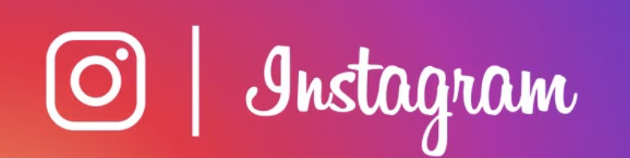

  

# Instagram DMs

## 
This teardown focuses on **Instagram DMs** as a product: the inbox, message requests, 1:1 and group threads, and the set of adjacent surfaces that *route intent into conversations* (Story reply, Send-to share sheet, profile “Message” entry).

**Not in scope (unless explicitly relevant):** Feed ranking, Reels algorithm, Ads, Marketplace, full Creator monetization.

---

## 1) Positioning (what Instagram DMs *are*)
Instagram DMs are the **private (and semi-private) conversation layer** built on top of Instagram’s public social graph and content consumption surfaces.

**Core promise:** “Take something you just saw (or felt) on Instagram and turn it into a conversation instantly.”

**Primary job to be done:**
- Convert lightweight social signals (follow/like/view/share) into **low-friction conversation starts**, then sustain the conversation with rich media.

**Secondary jobs:**
- Coordinate (plans, logistics) without leaving Instagram.
- Maintain social closeness (check-ins, memes, voice notes).
- Creator ↔ fan interaction and lightweight relationship management.

**What makes Instagram DMs distinct vs ‘pure’ messengers:**
- Messaging is **content-anchored** (Stories, Reels, posts are conversation objects).
- It rides a **discovery engine + social proof** (profile + mutuals + content context lowers first-message risk).
- It’s **identity-forward**: messaging is tied to a persona with public content, not just a phone number.

---

## 2) User segmentation (who uses DMs and why)
Think less “demographics” and more “moments + stakes”.

### Segment A - Friends & micro-groups (high frequency)
- **Moment:** sharing funny/relatable content; making plans; staying close.
- **Stakes:** low; speed and expression matter.
- **Behaviors:** group threads, reactions, voice notes, fast back-and-forth.

### Segment B - Lightweight reach-outs (medium frequency)
- **Moment:** “I want to DM someone I know of (mutuals) / I’m curious.”
- **Stakes:** medium; fear of rejection/awkwardness.
- **Behaviors:** Story replies, Reel shares with short text.

### Segment C - Creator ↔ fan / public accounts (high inbound, low reply capacity)
- **Moment:** fans react, ask questions, propose collabs; creators triage.
- **Stakes:** higher; reputation + safety.
- **Behaviors:** message requests management, filtering, sometimes quick replies.

### Segment D - Small businesses (high intent, transactional)
- **Moment:** inquiries, pricing, availability; support.
- **Stakes:** higher; response time and trust matter.
- **Behaviors:** quick back-and-forth, sharing links/photos, sometimes moving off-platform.

### Segment E - Bad actors / spam / scams (adversarial)
- **Moment:** cold outreach, impersonation, phishing, payment fraud.
- **Stakes:** high for integrity.
- **Behaviors:** high-volume requests; social engineering.

---

## 3) The product thesis: “content → conversation”
Instagram DMs win when they minimize the distance between:
1) **Exposure** to content/person
2) **Expression** (share/reply)
3) **Reciprocation** (reaction/reply)
4) **Continuation** (thread becomes habit)

The core design pattern: **message objects carry context** (the Story/Reel/post), reducing the burden of writing a “cold open”.

---

## 4) Core loops (with triggers and failure modes)

### Loop A - Discovery → first DM → ongoing relationship
1. User discovers someone via profile, comments, mutuals.
2. Entry via **Message** or contextual reply (Story).
3. Recipient sees it in Inbox or Requests.
4. If accepted/replied → thread becomes active.

**Key enablers:** social proof, mutuals, content context.

**Failure modes:**
- lands in Requests and is never seen; safety friction blocks legitimate new connections.
- first message has insufficient context; recipient doesn’t reciprocate.

### Loop B - Content consumption → share/reply → conversation
1. User views a Story/Reel/post.
2. Uses **Send-to** or Story reply.
3. Content appears anchored in thread.
4. Recipient reacts/replies → conversation continues.

**Failure modes:**
- recipient suggestions feel wrong → user doesn’t share.
- too much sharing without conversation → threads become “broadcast dumps”.

### Loop C - Group chat energy → entertainment + coordination → retention
1. Group forms around friends/event.
2. Members share media and logistics.
3. Reactions + quick replies keep it alive.
4. Group becomes daily habit.

**Failure modes:**
- notification overload; groups mute/lose salience.
- low participation; group becomes a one-person share channel.

### Loop D - Creator inbound → triage → relationship reinforcement
1. Fans DM via Story replies/profile.
2. Creator receives high inbound volume.
3. Creator replies to a subset; fans feel seen.
4. Fans re-engage on future content → more inbound.

**Failure modes:**
- creator inbox overload → low reply rate → fans churn.
- spam floods Requests; true fans never surface.

---

## 5) Surface map (what each surface optimizes for)

### 5.1 Inbox (DM home)
**Optimization:** return-to-inbox habit, fast resumption, surfacing priority threads.
- Recent threads list (recency/importance ranking).
- Shortcuts to compose/new message.
- Often includes adjacent re-engagement surfaces (e.g., Notes in some builds).

**Design tension:** “keep it calm” vs “drive engagement”.

### 5.2 Message Requests
**Optimization:** safety + consent boundary.
- Bucket for non-follower/non-approved contacts.
- Accept/decline/block gating.

**Design tension:** reduce harassment/spam while not killing legitimate new connections.

### 5.3 Thread (1:1)
**Optimization:** expressive, low-friction conversation.
- Composer + attachments.
- Reply-to (quote context), reactions, media mixing.

**Design tension:** feature richness vs complexity; moderation visibility vs privacy.

### 5.4 Thread (Group)
**Optimization:** concentration of social energy.
- Membership management, naming, visibility.

**Design tension:** group dynamics create retention but also abuse/overload.

### 5.5 Story reply entry
**Optimization:** turn passive viewing into active engagement.
- Immediate conversational prompt.

**Design tension:** makes it easy to message someone who didn’t ask for contact (needs safety controls).

### 5.6 Share sheet (“Send to”)
**Optimization:** maximize share-to-DM conversion.
- Suggested recipients + search.

**Design tension:** suggestion ranking has outsized impact on behavior; mistakes feel socially risky.

### 5.7 Voice notes + Calls (escalation)
**Optimization:** increase bandwidth and closeness.
- Voice notes reduce typing friction.
- Calls shift async to sync.

**Design tension:** more intimacy also increases harassment risk; needs controls/reporting.

---

## 6) North star + metric tree (practical)
A reasonable product north star for DMs is:

**North star:** *Meaningful back-and-forth conversations per user per week*
- Operational proxy: **# of threads with ≥2-way exchange** (A sends, B responds) within 24-48h.

### Acquisition / Activation
- **DM activation rate:** % users who send ≥1 DM in N days.
- **First conversation success:** % initiated threads that receive a reply within 24-48h.
- **Requests seen rate:** % requests viewed within 24h.
- **Requests acceptance rate:** accepted / total requests.
- **Share-to-DM conversion:** content views → share/reply into DM.

### Engagement
- **% DAU sending:** senders / DAU.
- **Messages per sender per day** (split 1:1 vs group).
- **Media mix:** share/story reply/voice/photo/video proportions.
- **Reactions per message** (lightweight acknowledgment health).

### Retention
- **Weekly messaging retention:** users who message in week 0 and week 1/4.
- **Thread stickiness:** active days per thread per week.
- **Group survival:** groups active at D+7/D+28.

### Safety / Quality
- **Spam rate in Requests:** classifier/report-derived.
- **Block-after-first-message rate** (early harm signal).
- **Harassment report rate per 1k threads**.
- **Teen safety events:** adult→teen attempts, prevention rate.

---

## 7) Moats (why Instagram DMs are hard to copy)
- **Content graph as messaging fuel:** Instagram’s content supply is the conversation starter engine.
- **Social proof context:** profiles + mutuals reduce cold-start friction.
- **Habit adjacency:** people open Instagram anyway; DMs capture incremental time.
- **Network effects in groups:** group threads lock in routines.

---

## 8) Key risks & tradeoffs 
- **Safety vs openness:** requests gating protects users but blocks legitimate discovery.
- **Spam/scams adapt quickly:** adversaries exploit social proof and urgency.
- **Creator scale:** inbound volume demands better triage tools.
- **Privacy expectations gap:** users assume “private” means safer than it is.
- **Feature creep:** too many modalities can make the core chat feel heavy.

---

## 9) Opportunity areas / experiment directions (refined)
1) **Requests quality gating**
   - Separate “likely wanted” vs “likely spam” requests; improve previews + explainability.
2) **Share sheet ranking improvements**
   - Optimize for “who would you send *this* to” (contextual similarity), not just recency.
3) **Conversation-start scaffolds**
   - Lightweight prompts when sharing (“ask”, “react”, “vote”) to increase reciprocation.
4) **Creator inbox triage**
   - Priority queueing, filters/labels, quick replies; protect against overload.
5) **Group health controls**
   - Nudges for participation, better digest/mute, lightweight governance.
6) **Safety UX**
   - Faster block/report, clearer boundaries, teen education + defaults.

---

## 10) Competitive comparison (what Instagram DMs win/lose on)
This isn’t a feature checklist-it’s “which system produces more *replied-to* conversations” and at what cost.

### Snapchat
- **Win vs IG:** camera-first, ephemeral norms, lower-pressure outreach → higher casual reply rates.
- **IG advantage:** richer content graph (Reels/Stories) as conversation objects; stronger creator/public identity context.
- **Takeaway:** IG’s opportunity is to keep *low-stakes* starts (Snap vibe) while preserving identity + content anchoring.

### WhatsApp
- **Win vs IG:** phone-number graph + high deliverability; strong reliability/utility; end-to-end encryption positioning.
- **IG advantage:** discovery + public social proof; faster “message someone you don’t already have.”
- **Takeaway:** IG should lean into discovery-to-DM, while borrowing WA’s trust cues (delivery, safety, clarity).

### iMessage
- **Win vs IG:** default status + OS-level presence; near-universal reach in iOS markets.
- **IG advantage:** cross-platform, identity/content context, creator + communities adjacency.
- **Takeaway:** IG competes by being the “social relationship layer,” not the default transport.

### TikTok DMs
- **Win vs IG:** algorithmic content gravity; sharing is constant.
- **IG advantage:** established friend graph + ongoing relationships; broader creation + social surfaces.
- **Takeaway:** protect the share→conversation loop; don’t become a one-way share dump.

**Implication for the metric tree:** the most defensible metric is not messages sent, but **initiations that get a reply** and **threads that sustain**.

---

## 11) Systems-level view (how the product likely works)
A practical mental model: Instagram DMs are three coupled systems.

### 11.1 Entry routing (where messages come from)
- **Story replies / Send-to shares / Profile Message CTA / Search compose** all funnel into thread creation.
- Goal: reduce friction *without* inviting abuse.

### 11.2 Inbox + share-sheet ranking (attention allocation)
- **Inbox ranking:** chooses which threads you see first (recency + predicted importance + relationship strength + unread count + prior reply probability).
- **Share-sheet ranking:** chooses who you’ll send to (recent, close friends, interaction similarity, group propensity).
- Failure mode: wrong ranking feels socially risky → users stop sharing/DMing.

### 11.3 Integrity & consent boundary (Requests + enforcement)
- **Requests classifier:** decides if inbound should be gated, warned, limited, or blocked.
- **Spam/abuse pipeline:** detection → friction → action (rate limits, shadow bans, blocks).
- **User controls:** block/report/mute + “who can message me” settings.

### 11.4 Notifications 
- Notifications convert “message sent” into “message replied.”
- Tradeoff: more pings boosts replies but increases fatigue; good systems learn personal thresholds.

---

## 12) DMs roadmap (3-5 bets tied to metrics)
### Bet 1 - Requests: "wanted vs spam" separation + clearer previews
- **Ship:** two-lane Requests (Likely Known / Likely Spam), preview context (mutuals, where you saw them), faster bulk actions.
- **Moves:** Requests seen rate ↑, accept rate ↑, block-after-first-message ↓.

### Bet 2 - Share sheet: contextual ranking + "send with prompt"
- **Ship:** per-content embedding similarity to rank recipients; optional prompt chips (“this reminded me of…”, “thoughts?”).
- **Moves:** share-to-DM conversion ↑, first conversation success ↑.

### Bet 3 - Conversation quality: reciprocation nudges
- **Ship:** lightweight "reply starters" in early thread moments; reduce cold-open burden.
- **Moves:** replied-to initiations ↑, 2-way exchange within 48h ↑.

### Bet 4 - Creator inbox: priority queue + triage tooling
- **Ship:** filters (fans, verified, recent engagers), quick replies, SLA cues.
- **Moves:** creator reply rate ↑, creator retention ↑, spam load ↓.

### Bet 5 - Group health: digest + governance primitives
- **Ship:** configurable digests, "mute with summary", lightweight roles/controls.
- **Moves:** group survival D+7/D+28 ↑, notification fatigue ↓.
